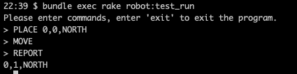
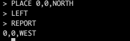
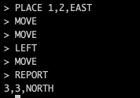
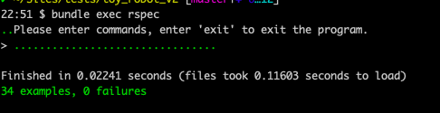

# Robot

Robot is a Ruby project that build toy robot, you can place the robot on a table and move around.

## Installation

Clone Toy Robot repo:

    $ git clone git@github.com:ruthw/toy_robot.git

Go into the project folder:

    $ cd robot

Install bundler if you don't have it:

    $ gem install bundler

And then install gems:

    $ bundle

## Usage

A rake task that start command runner as simple CLI, enter 'exit' to exit program:

    $ rake robot:test_run

Screenshot for passing sample tests:

## Tests

To run rspec tests:

    $ rspec

Screenshot for passing rspec:

## Code locations

Classes:
- robot/lib/command_runner.rb
- robot/lib/parser.rb
- robot/lib/reporter.rb
- robot/lib/robot.rb
- robot/lib/robot_mover.rb
- robot/lib/table.rb
- robot/lib/validator.rb

Specs:
- robot/spec/command_runner_spec.rb
- robot/spec/parser_spec.rb
- robot/spec/reporter_spec.rb
- robot/spec/robot_spec.rb
- robot/spec/robot_mover_spec.rb
- robot/spec/table_spec.rb
- robot/spec/validator_spec.rb

Rake task:
- robot/lib/tasks/robot.rake

## Assumptions
As the requirement describe one robot move on the table and there are no other obstructions, the code only build for one robot (no multiple robots). Therefore don't need to consider one robot run over another one or on top of another one etc.

## Decisions and Reasons
1. ALL_DIRECTIONS use symbols instead of string, faster and better

2. Break down the robot moving problem into smaller classes, so each class will handle only one responsibility. Which will make code structure clean, also easy to extend later. Such as if need more different report formate, the only one class need to touch is the 'Reporter'.

## Future possible improvements if have more time
1. Rspec, DRY up tests little more by using shared context etc
2. Rspec, add FactoryBot to mock up for tests with defined object to share in tests
3. Input command is currently case sensitive, and only handle exactly same command. Can improve to be not case sensitive.

## Authors
Xiaoning (Ruth) Wang